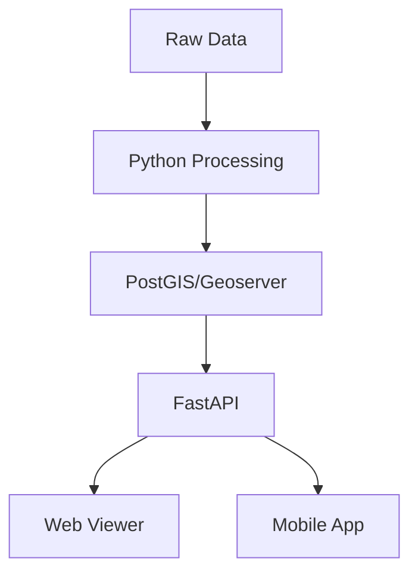

# Geospatial Visualization Pipeline Setup

## Technology Stack

### Phase 1: Data Processing & Initial Visualization
- **QGIS** (Desktop): Initial data exploration and validation
- **Python Ecosystem**:
  - `geopandas`: Geospatial data manipulation
  - `rasterio`: Raster data processing
  - `xarray`: Multi-dimensional array handling
  - `pandas`: Data manipulation
  - `numpy`: Numerical operations

### Phase 2: Web-Based Visualization (Development)
- **Backend**:
  - `FastAPI`: Modern, fast API framework
  - `PostGIS/PostgreSQL`: Spatial database
  - `Geoserver`: OGC-compliant map server
- **Frontend (Web Testing)**:
  - `CesiumJS`: 3D globe visualization
  - `deck.gl`: WebGL-powered visualization
  - `React`: UI framework
  - `Mapbox GL JS`: Base maps and layers

### Phase 3: Mobile Integration
- **React Native + Expo**:
  - `react-native-maps`: Basic mapping
  - `expo-gl`: OpenGL bindings
  - `react-native-cesium`: 3D globe (custom wrapper)
- **State Management**:
  - `Redux Toolkit`: Global state
  - `React Query`: Server state

## Implementation Steps

### Step 1: Data Processing Pipeline
1. **Setup Python Environment**
   ```bash
   conda create -n geospatial python=3.10
   conda activate geospatial
   conda install -c conda-forge geopandas rasterio xarray pandas numpy jupyter
   ```

2. **Data Validation & Preprocessing**
   - Create Jupyter notebooks for each dataset
   - Validate data formats and projections
   - Convert to standardized formats
   - Generate metadata
   - Test output with QGIS

3. **Testing**
   ```python
   # test_data_processing.py
   def test_raster_loading():
      # Test MODIS data loading
   def test_vector_loading():
      # Test admin boundaries
   def test_time_series():
      # Test rainfall data
   ```

### Step 2: Backend Development
1. **Setup FastAPI Server**
   ```bash
   pip install fastapi uvicorn sqlalchemy geoalchemy2 psycopg2-binary
   ```

2. **Database Setup**
   ```sql
   CREATE EXTENSION postgis;
   CREATE EXTENSION postgis_raster;
   ```

3. **Testing**
   ```python
   # test_api.py
   def test_raster_endpoints():
      # Test tile serving
   def test_vector_endpoints():
      # Test boundary data
   ```

### Step 3: Web Visualization
1. **Setup React Project**
   ```bash
   npx create-react-app globe-viewer --template typescript
   npm install @cesium/engine @deck.gl/core @deck.gl/layers
   ```

2. **Testing**
   ```typescript
   // test_visualization.ts
   test('Globe renders correctly', () => {})
   test('Layer switching works', () => {})
   ```

### Step 4: Mobile Integration
1. **Setup Expo Project**
   ```bash
   npx create-expo-app -t expo-template-blank-typescript
   ```

2. **Custom Native Modules**
   - Create CesiumView component
   - Implement layer management
   - Optimize for mobile performance

3. **Testing**
   ```typescript
   // test_mobile.ts
   test('Mobile globe renders', () => {})
   test('Performance meets threshold', () => {})
   ```

## Data Flow Architecture


## Performance Considerations
1. **Tiling Strategy**
   - Generate pyramids for raster data
   - Implement vector tiling
   - Use appropriate zoom levels

2. **Caching**
   - Implement client-side caching
   - Set up CDN for static assets
   - Use Redis for API caching

3. **Mobile Optimization**
   - Implement progressive loading
   - Use WebAssembly for heavy computations
   - Optimize texture sizes

## Getting Started

### Step 1: Initial Setup
1. Clone this repository
2. Install QGIS for initial data validation
3. Set up Python environment
4. Run initial data processing tests
5. Verify outputs in QGIS

### Next Steps
After completing Step 1, we'll:
1. Set up the FastAPI backend
2. Configure PostGIS database
3. Implement web visualization
4. Develop mobile integration

## Testing Strategy
Each phase includes:
1. Unit tests for data processing
2. Integration tests for API endpoints
3. Performance tests for visualization
4. End-to-end tests for mobile app

## Monitoring & Logging
- Use OpenTelemetry for tracing
- Implement Prometheus metrics
- Set up ELK stack for logging
- Monitor mobile app performance 